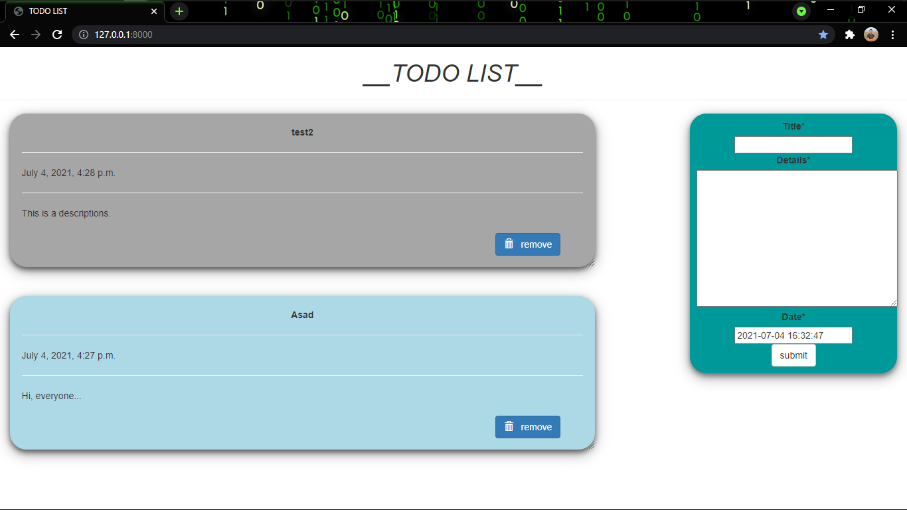

# ToDo-WebApp-using-Django

#1.install crispy-forms 
$pip install --upgrade django-crispy-forms

#2.Create project and app 
$django-admin startproject todo-site . 
$python manage.py runserver 
$ctrl-c 
$python manage.py startapp todo 

#3.todo-site/settings.py

INSTALLED_APPS = [ 
    'todo', 
    'crispy_forms', 
    'django.contrib.admin', 
    'django.contrib.auth', 
    'django.contrib.contenttypes', 
    'django.contrib.sessions', 
    'django.contrib.messages', 
    'django.contrib.staticfiles', 
]

#4.Edit file in todo_site/urls.py,  

from django.contrib import admin 
from django.urls import path 
from todo import views 

urlpatterns = [ 
    path('admin/', admin.site.urls), 
    #####################home_page########################################### 
    path('', views.index, name="todo"), 
    ####################give id no. item_id name or item_id=i.id ############ 
    path('del/<item_id>', views.remove, name="del"), 
]

#5. todo/models.py

from django.db import models 
from django.utils import timezone 

# Create your models here.
class Todo(models.Model): 
    title = models.CharField(max_length= 100) 
    details = models.TextField() 
    date = models.DateTimeField(default=timezone.now) 

    def __str__(self):
        return self.title

6. todo/views.py 

from django.shortcuts import render, redirect 
from django.contrib import messages 

## import todo from and models
from .forms import TodoForm 
from .models import Todo 

# Create your views here.
def index(request): 
    item_list = Todo.objects.order_by("-date") 
    if request.method == "POST": 
        form = TodoForm(request.POST) 
        if form.is_valid(): 
            form.save() 
            return redirect('todo') 
    form = TodoForm() 

    page = {
                "forms" : form,
                "list" : item_list,
                "title" : "TODO LIST",
    }
    return render(request, 'todo/index.html', page)

### function to remove item, it receive todo item id from url ##

def remove(request, item_id): 
    item = Todo.objects.get(id=item_id) 
    item.delete() 
    messages.info(request, "item removed !!!") 
    return redirect('todo') 

#7.todo/forms.py

from django import forms 
from django.forms import fields 
from .models import Todo 

class TodoForm(forms.ModelForm): 
    class Meta: 
        model = Todo 
        fields = "__all__" 

#8.Register models to todo/admin.py

from django.contrib import admin 

from .models import Todo 
# Register your models here.
admin.site.register(Todo)

#9.Navigate to templates/todo/index.html and edit it


<!DOCTYPE html>
<html lang="en" dir="ltr">

<head>

  <meta charset="utf-8">
  <title>{{title}}</title>
  <meta name="viewport" content="width=device-width, initial-scale=1">
  <link rel="stylesheet" href="https://maxcdn.bootstrapcdn.com/bootstrap/3.3.7/css/bootstrap.min.css">
  
  
  <!--style-->
  

</head>

<body  class="container-fluid">

  
  
  

    <strong>{{message}}</strong>
  

  
  

  

    <h1><i>__TODO LIST__</i></h1>
    

  

  

    

      
      

        
<b>{{i.title}}</b>

        

        {{i.date}}
        

        {{i.details}}
         
         
        <form action="/del/{{i.id}}" method="POST" style=" padding-right: 4%; padding-bottom: 3%;">
          
          <button value="remove" type="submit"  class="btn btn-primary" style="float: right;"> &nbsp; remove</button>
        </form>
      

      
    

    
 

    

      

      <form  method="POST">
        
        {{forms|crispy}}
        

        <input type="submit" class="btn btn-default" value="submit" />
      

      </form>
    

  

</body>

</html>

#10.Make migrations and migrate it 

$python manage.py makemigrations 
$python manage.py migrate

11.run the server to see your todo app 

$python manage.py runserver

and go http://127.0.0.1:8000/
